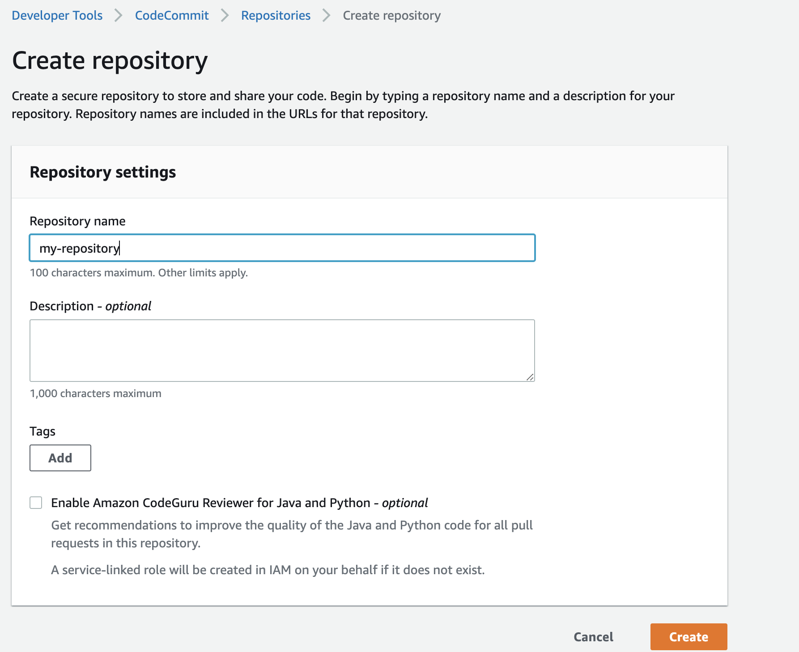
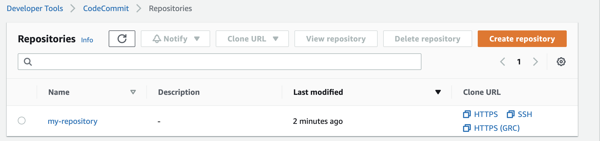
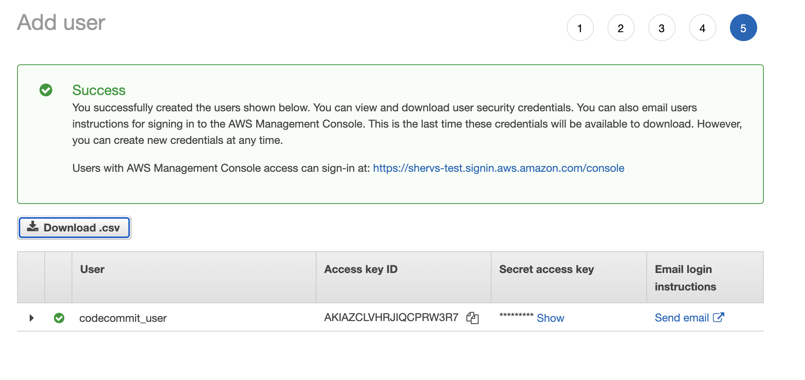
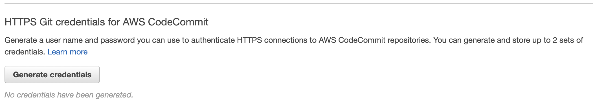
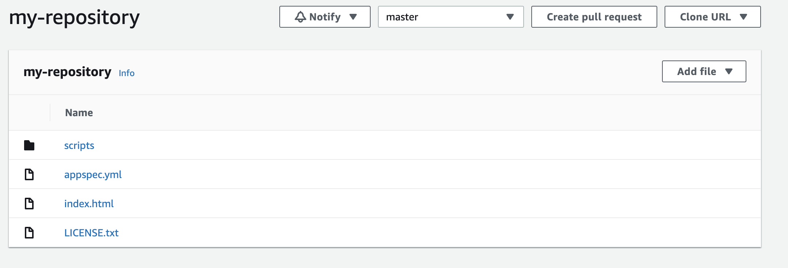
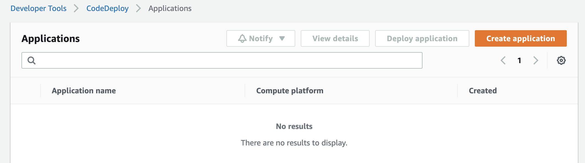

# CI/CD pipeline using Gitlab CI to containerise and deploy a two tier architecture app to AWS ECS with an Application Load Balencer to distribute traffic.

## Intro

 In this project i'm going to build a CICD pipeline in aws using the following aws services

 - JavaScript
 - MongDb
 - Gitlab CI
 - AWS ECS
 - AWS VPC
 - AWS Application Load Balencer

 such that when a change is pushed to code commit this triggers the pipeline to push code to the ec2 instance.


 ## EC2 Setup

 - Launch and ubuntu ec2, and ensure port 80 and 22 are open in the scurity groups. In this ec2 you must install the codedeploy agent, and an Apache web server. Give a name tag to the ec2 so codedeploy can access it and attach the IAM policies of `AmazonEC2RoleforAWSCodeDeploy` and `AmazonSSMManagedInstanceCore`.

 ```
 https://docs.aws.amazon.com/codedeploy/latest/userguide/codedeploy-agent-operations-install-ubuntu.html

 ```


 ## CodeCommit Configuration

 - Firstly we have to build a CodeCommit depository. By entering CodeCommit, and clicking on 'create reporsitory', afterwhich we give a name to our repository and finally click on create.




- Next in our console we have to go to IAM and create a user. This is the user we will use to make changes so once created we will have to grant it the 'codecommit power use' permissions policy, so it may access codecommit and make commits.




- Next we sign in as our IAM user, and back in IAM we create https credentials for access to code commit.



- We can now clone our repository, add your code files, add to the staging area, and finally commit and make a push to code commit via `git push origin master`




 ## CodeDeploy Configuration

 - Firstly we need to create another IAM role and attach it to the aws service `codeDeploy`. This service should have the `AWSCodeDeployRole` policy attached.

 - Next we move on to the CodeDeploy and create an application.

 
 

 - After creating the application you will move into another window where you will then need to create a deployment group, add the service role and give it a name.
