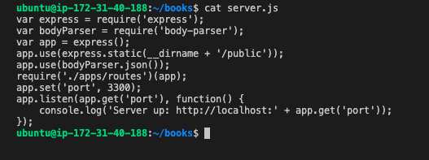
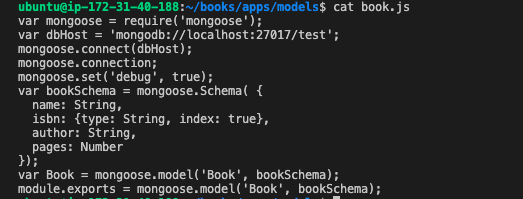
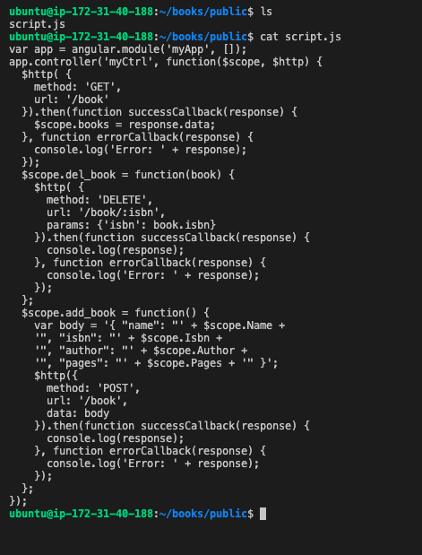
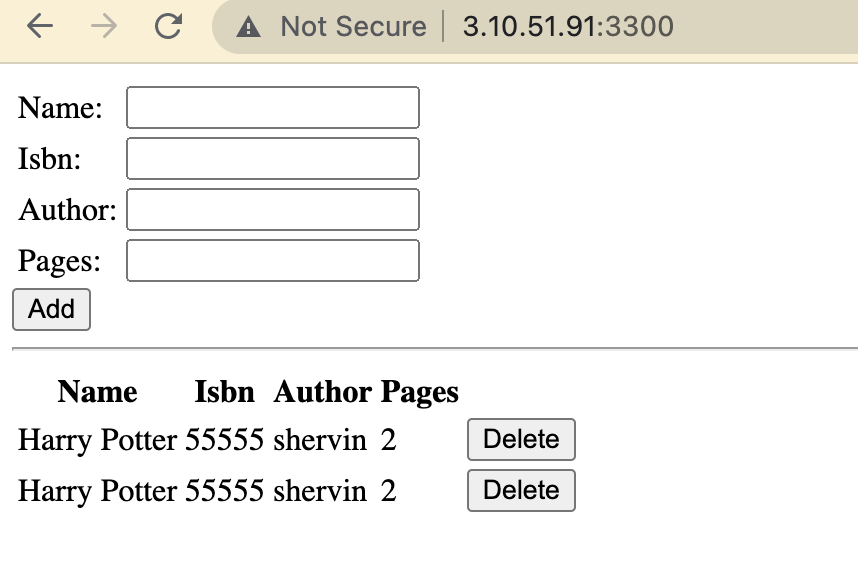

# MEAN Stack Application

In this, I will create a step-by-step guide on how I deoplyed a MEAN stack application. MEAN Stack meaning:

- MongoDB (document Database) allows to store and retrieve data
- Express (Back-end framework) make request to Database 
- Angular (Front-end framework) Handles Client and Server requests
- Node.js (Javascript Runtime Env) accepts request and display result to user

I will be deploying this on an ec2 on aws with an 20.04 ubuntu OS, which is set up before hand.


## Node.js Installation on EC2

- Firstly we update and upgrade our system afterwhich we install node.js. 

```
sudo apt update
sudo apt upgrade

sudo apt -y install curl dirmngr apt-transport-https lsb-release ca-certificates 
curl -sL https://deb.nodesource.com/setup_12.x | sudo -E bash -


sudo apt install -y nodejs

```


## MongoDb Installation

- We move on to the mongoDB installation along with a few other packages, including 'npm', 'body-parser'.

```
sudo apt-key adv --keyserver hkp://keyserver.ubuntu.com:80 --recv 0C49F3730359A14518585931BC711F9BA15703C6
echo "deb [ arch=amd64 ] https://repo.mongodb.org/apt/ubuntu trusty/mongodb-org/3.4 multiverse" | sudo tee /etc/apt/sources.list.d/mongodb-org-3.4.list

sudo apt install -y mongodb
sudo service mongodb start
sudo systemctl status mongodb

sudo apt install -y npm
sudo npm install body-parser

```


- Next I move on to creating a folder called 'books' via `mkdir books` to which in the file i type `npm init`. In books I create 'server.js' which in I place the following.

```
var express = require('express');
var bodyParser = require('body-parser');
var app = express();
app.use(express.static(__dirname + '/public'));
app.use(bodyParser.json());
require('./apps/routes')(app);
app.set('port', 3300);
app.listen(app.get('port'), function() {
    console.log('Server up: http://localhost:' + app.get('port'));
});
```



## Express Installation and Routes Setup

- the Mongoose package is installed as it provides a straight forward schema-base solution to model our application data. `sudo npm install express mongoose`.
- Within our books directory we create a folder called apps in which we create a file called 'routes.js'. In routes.js the following is placed:

```
var Book = require('./models/book');
module.exports = function(app) {
  app.get('/book', function(req, res) {
    Book.find({}, function(err, result) {
      if ( err ) throw err;
      res.json(result);
    });
  }); 
  app.post('/book', function(req, res) {
    var book = new Book( {
      name:req.body.name,
      isbn:req.body.isbn,
      author:req.body.author,
      pages:req.body.pages
    });
    book.save(function(err, result) {
      if ( err ) throw err;
      res.json( {
        message:"Successfully added book",
        book:result
      });
    });
  });
  app.delete("/book/:isbn", function(req, res) {
    Book.findOneAndRemove(req.query, function(err, result) {
      if ( err ) throw err;
      res.json( {
        message: "Successfully deleted the book",
        book: result
      });
    });
  });
  var path = require('path');
  app.get('*', function(req, res) {
    res.sendfile(path.join(__dirname + '/public', 'index.html'));
  });
};
```


- We also create a folder called `models` in which we place our `book.js` which contains the following:

```
var mongoose = require('mongoose');
var dbHost = 'mongodb://localhost:27017/test';
mongoose.connect(dbHost);
mongoose.connection;
mongoose.set('debug', true);
var bookSchema = mongoose.Schema( {
  name: String,
  isbn: {type: String, index: true},
  author: String,
  pages: Number
});
var Book = mongoose.model('Book', bookSchema);
module.exports = mongoose.model('Book', bookSchema);
```


## Express Installation and Routes Setup

- We know move on to accessing our routes via AngularJS, as angularJS provides a web framework for creating dynamic views in our application.
- Within out 'books' directory we create a folder called 'public'. In public we create our script.js in which we place:

```
var app = angular.module('myApp', []);
app.controller('myCtrl', function($scope, $http) {
  $http( {
    method: 'GET',
    url: '/book'
  }).then(function successCallback(response) {
    $scope.books = response.data;
  }, function errorCallback(response) {
    console.log('Error: ' + response);
  });
  $scope.del_book = function(book) {
    $http( {
      method: 'DELETE',
      url: '/book/:isbn',
      params: {'isbn': book.isbn}
    }).then(function successCallback(response) {
      console.log(response);
    }, function errorCallback(response) {
      console.log('Error: ' + response);
    });
  };
  $scope.add_book = function() {
    var body = '{ "name": "' + $scope.Name + 
    '", "isbn": "' + $scope.Isbn +
    '", "author": "' + $scope.Author + 
    '", "pages": "' + $scope.Pages + '" }';
    $http({
      method: 'POST',
      url: '/book',
      data: body
    }).then(function successCallback(response) {
      console.log(response);
    }, function errorCallback(response) {
      console.log('Error: ' + response);
    });
  };
});
```



- In `public` we also create our html page in a file names index.html:

```
<!doctype html>
<html ng-app="myApp" ng-controller="myCtrl">
  <head>
    <script src="https://ajax.googleapis.com/ajax/libs/angularjs/1.6.4/angular.min.js"></script>
    <script src="script.js"></script>
  </head>
  <body>
    <div>
      <table>
        <tr>
          <td>Name:</td>
          <td><input type="text" ng-model="Name"></td>
        </tr>
        <tr>
          <td>Isbn:</td>
          <td><input type="text" ng-model="Isbn"></td>
        </tr>
        <tr>
          <td>Author:</td>
          <td><input type="text" ng-model="Author"></td>
        </tr>
        <tr>
          <td>Pages:</td>
          <td><input type="number" ng-model="Pages"></td>
        </tr>
      </table>
      <button ng-click="add_book()">Add</button>
    </div>
    <hr>
    <div>
      <table>
        <tr>
          <th>Name</th>
          <th>Isbn</th>
          <th>Author</th>
          <th>Pages</th>

        </tr>
        <tr ng-repeat="book in books">
          <td>{{book.name}}</td>
          <td>{{book.isbn}}</td>
          <td>{{book.author}}</td>
          <td>{{book.pages}}</td>

          <td><input type="button" value="Delete" data-ng-click="del_book(book)"></td>
        </tr>
      </table>
    </div>
  </body>
</html>
```


- We now start server.js via `node server.js`. This is also accompanies by changing the security groups of our EC2 to allow inbound traffic on port 3000.


