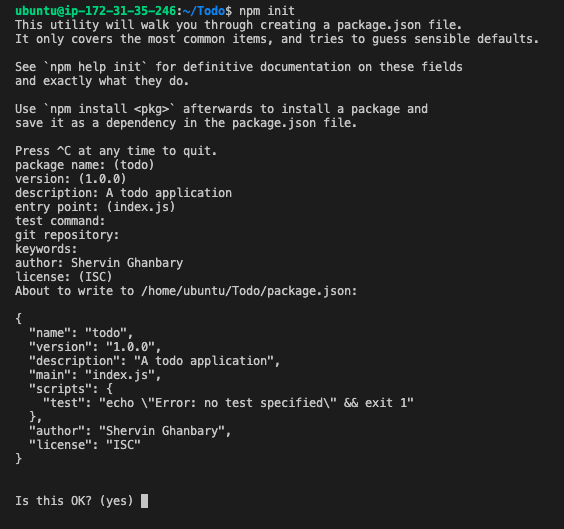
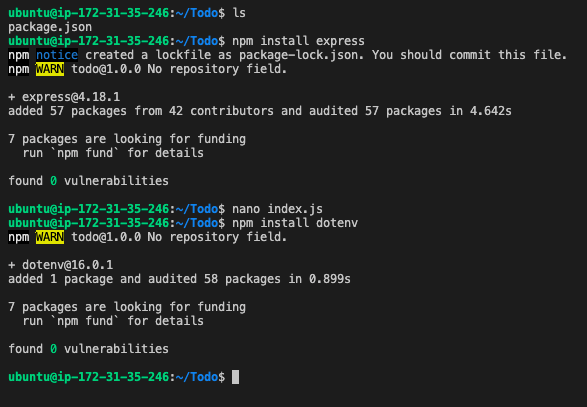
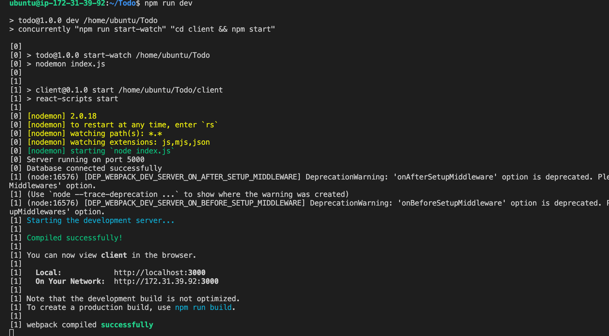
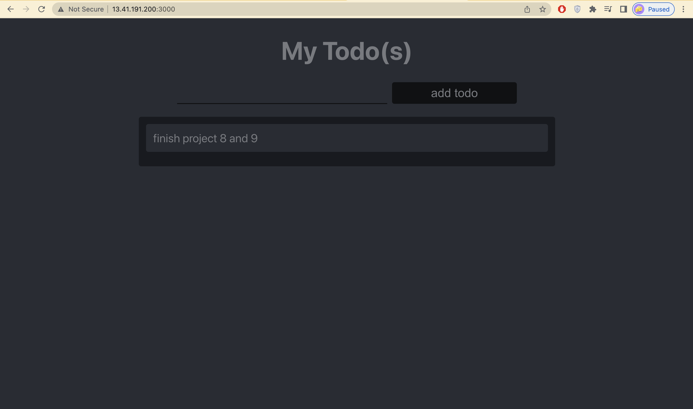

# Aker-Systems-Project-3-MERN-Stack-Implementation

## Intro

In this project I'm going to implement a MERN stack web application consisting off the following:
- MongoDB  -- The database
- ExpressJs -- backend
- ReactJS -- backend
- Node.js -- front-end/client-side

This will be done using an aws EC2.

## Backend Configuration

Firstly, I run the series of command below to update and upgrade my OS, along with installing NodeJS, and verifying the installation.

```
# Ubuntu (20.04) ec2
sudo apt update
sudo apt upgrade

# get location of node.js from ubuntu repository, amd install
curl -sL https://deb.nodesource.com/setup_12.x | sudo -E bash -

# Check installation
sudo apt-get install -y nodejs
node -v 
npm -v
```


We next move on to create our application code, which involves creating a directory, 'Todo', and initialise the project via `npm init`.



## ExpressJS Installation

Express helps us define routes of our application based on HTTP methods and URLs. We first need to install express and dotenv, along with create and index.js file.

```
npm install express
touch index.js
npm install dotenv
```

Index js we place the following

```
const express = require('express');
require('dotenv').config();

const app = express();

const port = process.env.PORT || 5000;

app.use((req, res, next) => {
res.header("Access-Control-Allow-Origin", "\*");
res.header("Access-Control-Allow-Headers", "Origin, X-Requested-With, Content-Type, Accept");
next();
});

app.use((req, res, next) => {
res.send('Welcome to Express');
});

app.listen(port, () => {
console.log(`Server running on port ${port}`)
});
```



We can now test the server through `node index.js`. Change the security groups in our ec2 to allow port 5000, and check the browser.


Next we are moving on to creating 'Routes', since our application should allow us to create a task, view all tasks, and delete completed tasks. They will be associated with POST,GET,DELETE request. I create a folder called 'routes' in which i create a file called 'app.js' and place the following below.

```
const express = require ('express');
const router = express.Router();

router.get('/todos', (req, res, next) => {

});

router.post('/todos', (req, res, next) => {

});

router.delete('/todos/:id', (req, res, next) => {

})

module.exports = router;
```

## Models

The schema and model, need to be created. The following commands are run to install mongoos as well as create a models folder of which I place a todo.js.

```
npm install mongoose
mkdir models && cd models && touch todo.js
```

In todo we create the schema and model. We then update api.js with the new routes.

```
const mongoose = require('mongoose');
const Schema = mongoose.Schema;

//create schema for todo
const TodoSchema = new Schema({
action: {
type: String,
required: [true, 'The todo text field is required']
}
})

//create model for todo
const Todo = mongoose.model('todo', TodoSchema);

module.exports = Todo;
```

New Routes (api.js)
```
const express = require ('express');
const router = express.Router();
const Todo = require('../models/todo');
```


## MongoDB

I create an account on mlab so i can use mongodb as a service. Afterwhich i create the DB and user. A .env file is created that contains the DB link, as an environment variable.

`DB = 'mongodb+srv://<username>:<password>@<network-address>/<dbname>?retryWrites=true&w=majority'`

The index.js is updated to reflect this next change.

```
const express = require('express');
const bodyParser = require('body-parser');
const mongoose = require('mongoose');
const routes = require('./routes/api');
const path = require('path');
require('dotenv').config();

const app = express();

const port = process.env.PORT || 5000;

//connect to the database
mongoose.connect(process.env.DB, { useNewUrlParser: true, useUnifiedTopology: true })
.then(() => console.log(`Database connected successfully`))
.catch(err => console.log(err));

//since mongoose promise is depreciated, we overide it with node's promise
mongoose.Promise = global.Promise;

app.use((req, res, next) => {
res.header("Access-Control-Allow-Origin", "\*");
res.header("Access-Control-Allow-Headers", "Origin, X-Requested-With, Content-Type, Accept");
next();
});

app.use(bodyParser.json());

app.use('/api', routes);

app.use((err, req, res, next) => {
console.log(err);
next();
});

app.listen(port, () => {
console.log(`Server running on port ${port}`)
});
```

- After starting the server the following result is seen below.


## Frontend Configuration

We next move on to the front-end, configuration and styling will be added.
We start of with a few installations. In the Todo directory the following is run:

```
npx create-react-app client

#axios a promise based HTTP client for the browser and node.js
npm install axios

# install concurrently
npm install concurrently --save-dev

# install nodemon to monitor server
npm install nodemon --save-dev

```
- Next the script object in 'package.json' is altered to the following:

```
"scripts": {
"start": "node index.js",
"start-watch": "nodemon index.js",
"dev": "concurrently \"npm run start-watch\" \"cd client && npm start\""
},

```
- The key-value pair for proxy must be added in the 'package.json', `"proxy": "http://localhost:5000"`.

This proxy configuration allows us to access our application from the browser, via localhost://5000.

We know move on to creating our react component.

Within Todo/client/src a directory called 'components' is created within which we create three files. `touch Input.js ListTodo.js Todo.js`.

Inside Input.js I place:

```
import React, { Component } from 'react';
import axios from 'axios';

class Input extends Component {

state = {
action: ""
}

addTodo = () => {
const task = {action: this.state.action}

    if(task.action && task.action.length > 0){
      axios.post('/api/todos', task)
        .then(res => {
          if(res.data){
            this.props.getTodos();
            this.setState({action: ""})
          }
        })
        .catch(err => console.log(err))
    }else {
      console.log('input field required')
    }

}

handleChange = (e) => {
this.setState({
action: e.target.value
})
}

render() {
let { action } = this.state;
return (
<div>
<input type="text" onChange={this.handleChange} value={action} />
<button onClick={this.addTodo}>add todo</button>
</div>
)
}
}

export default Input
```

Inside ListTodo.js I place:

```
import React from 'react';

const ListTodo = ({ todos, deleteTodo }) => {

return (
<ul>
{
todos &&
todos.length > 0 ?
(
todos.map(todo => {
return (
<li key={todo._id} onClick={() => deleteTodo(todo._id)}>{todo.action}</li>
)
})
)
:
(
<li>No todo(s) left</li>
)
}
</ul>
)
}

export default ListTodo
```

Inside Todo.js I place:

```
import React, {Component} from 'react';
import axios from 'axios';

import Input from './Input';
import ListTodo from './ListTodo';

class Todo extends Component {

state = {
todos: []
}

componentDidMount(){
this.getTodos();
}

getTodos = () => {
axios.get('/api/todos')
.then(res => {
if(res.data){
this.setState({
todos: res.data
})
}
})
.catch(err => console.log(err))
}

deleteTodo = (id) => {

    axios.delete(`/api/todos/${id}`)
      .then(res => {
        if(res.data){
          this.getTodos()
        }
      })
      .catch(err => console.log(err))

}

render() {
let { todos } = this.state;

    return(
      <div>
        <h1>My Todo(s)</h1>
        <Input getTodos={this.getTodos}/>
        <ListTodo todos={todos} deleteTodo={this.deleteTodo}/>
      </div>
    )

}
}

export default Todo;
```


Going back one directory into 'src'.

Firstly App.js is altered to:

```
import React from 'react';

import Todo from './components/Todo';
import './App.css';

const App = () => {
return (
<div className="App">
<Todo />
</div>
);
}

export default App;
```

Next App.css is altered to:

```
.App {
text-align: center;
font-size: calc(10px + 2vmin);
width: 60%;
margin-left: auto;
margin-right: auto;
}

input {
height: 40px;
width: 50%;
border: none;
border-bottom: 2px #101113 solid;
background: none;
font-size: 1.5rem;
color: #787a80;
}

input:focus {
outline: none;
}

button {
width: 25%;
height: 45px;
border: none;
margin-left: 10px;
font-size: 25px;
background: #101113;
border-radius: 5px;
color: #787a80;
cursor: pointer;
}

button:focus {
outline: none;
}

ul {
list-style: none;
text-align: left;
padding: 15px;
background: #171a1f;
border-radius: 5px;
}

li {
padding: 15px;
font-size: 1.5rem;
margin-bottom: 15px;
background: #282c34;
border-radius: 5px;
overflow-wrap: break-word;
cursor: pointer;
}

@media only screen and (min-width: 300px) {
.App {
width: 80%;
}

input {
width: 100%
}

button {
width: 100%;
margin-top: 15px;
margin-left: 0;
}
}

@media only screen and (min-width: 640px) {
.App {
width: 60%;
}

input {
width: 50%;
}

button {
width: 30%;
margin-left: 10px;
margin-top: 0;
}
}
```

Index.css is changed to:

```
body {
margin: 0;
padding: 0;
font-family: -apple-system, BlinkMacSystemFont, "Segoe UI", "Roboto", "Oxygen",
"Ubuntu", "Cantarell", "Fira Sans", "Droid Sans", "Helvetica Neue",
sans-serif;
-webkit-font-smoothing: antialiased;
-moz-osx-font-smoothing: grayscale;
box-sizing: border-box;
background-color: #282c34;
color: #787a80;
}

code {
font-family: source-code-pro, Menlo, Monaco, Consolas, "Courier New",
monospace;
}
```

Finally we can run our application, in the Todo directory we run the application via `npm run dev`.



