# Intro

In this project I will deploy a full-scale three tier web solution with the WordPress content management system. This will consist of: 
- Configuring storage system for Web and Database servers.
- Install and connect WordPress to MySQL database server.

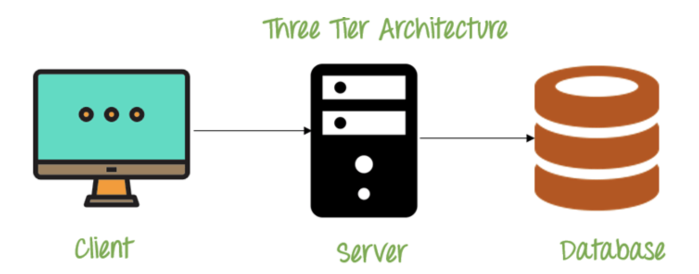

My three-tier architecture will involve:
- Client - My personal Laptop
- Web Server - A configured EC2 (wordpress)
- Database - A configured EC2 (DB)

The linux based distribution I will be using is 'RedHat'.


## Web Server

- Firstly we spin-up an ec2 'RedHat', that will serve as a our web-server.
- Next we create 3 new volumes in the same AZ as our web-server with each being 1gb and attach them to our ec2 instance.

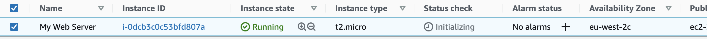
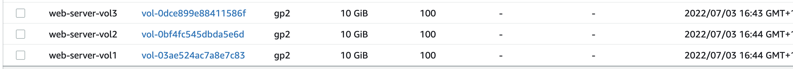

- We can see the attached block devices to our web server through `lsblk`.

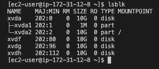


```
# to seee mounts
df -h 
```

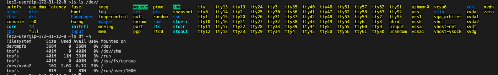


- Next we move on to creating one partition in each of the three volumes 'xvdf', 'xvdg', and 'xvdh'.

```
sudo gdisk /dev/xvdf
# input values include 'n', 'w', and 'yes'
```
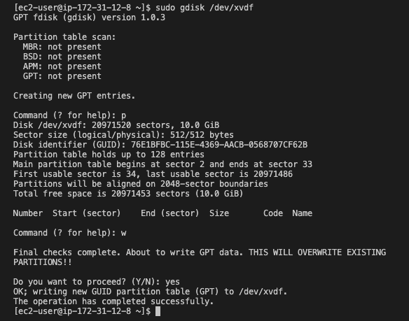

- A check to view partitions `lsblk`.
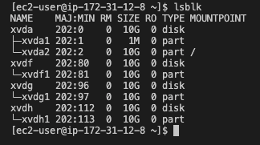

- We can also view these partiotions via:

```
sudo ym install lvm2
sudo lvmdiskscan
```


- Next we use `pvcreate` to mark each of the disks as physical volumes.

```
sudo pvcreate /dev/xvdf1
sudo pvcreate /dev/xvdg1
sudo pvcreate /dev/xvdh1

# verify
sudo pvs
```
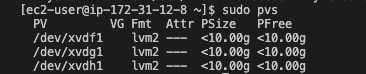

- We then use `vgcreate` to add all three physical volumes to a volume group called <strong>webdata-vg</strong>.

```
sudo vgcreate webdata-vg /dev/xvdh1 /dev/xvdg1 /dev/xvdf1

# verify
sudo vgs
```
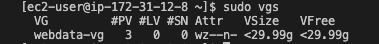

- We next move on to creating our logical volumes (LV), we shall call it <strong>apps-lv</strong>, and <strong>logs-lv</strong>.

```
sudo lvcreate -n logs-lv -L 14G webdata-vg
sudo lvcreate -n apps-lv -L 14G webdata-vg

# verify 
sudo lvs
```

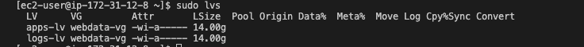

- Finally we verify the volume setup:

```
# Complete view
sudo vgdisplay -v 

sudo lsblk
```

- We use mkfs.ext4 to format the logical volumes with the ext4 filesystem. Furthermore we will also create the directories to store our website files and the backups of the log data.
- Additionally we will also mount the created directory to our logical volume 'apps-lv'.

```
# format logical volumes
sudo mkfs -t ext4 /dev/webdata-vg/apps-lv
sudo mkfs -t ext4 /dev/webdata-vg/logs-lv

# create directories for our filesystem.
sudo mkdir -p /var/www/html
sudo mkdir -p /home/recovery/logs

# mount the /var/www/html/directory to apps-lv logical volume.
sudo mount /dev/webdata-vg/apps-lv /var/www/html/

# Backup our files into log directory /var/log into the directory we just created /home/recovery/logs
sudo rsync -av /var/log/. /home/recovery/logs/

sudo mount /dev/webdata-vg/logs-lv /var/log

# Restore log files back into /var/log
sudo rsync -av /home/recovery/logs/. /var/log
```

## Ensure Mount Configuration Persistance

- We next move on to updating `/etc/fstab`, so that our mount configuration persists after our server is restarted.
- We add the UUID values to `/etc/fstab`.

```
# view UUID
sudo blkd

# update fstab file with new uuid
sudo vi /etc/fstab

```
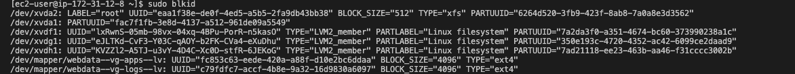
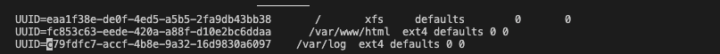

- Finally we test our configuration.

```
sudo mount -a sudo systemctl daemon-reload
df -h
```
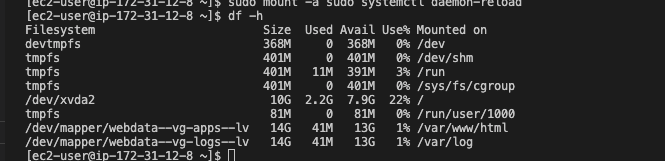


## Database Server Setup

- Just like how we configured the volumes on our web-server we do the same thing, but insted of app-lv we create `db-lv` for our logical volume.
- The security groups are ammended to allow inbound connection on port 3306, for MySQL.
- We next move on to installing mysql, as well as creating a user with remote access permissions which we will then use to connect our wordpress to the DB.

```
# update and installation
sudo yum update
sudo yum install mysql-server

# restart from dead and enable so service is up after server reboots.
sudo systemctl restart mysqld
sudo systemctl enable mysqld

#verify if active
sudo systemctl status mysqld
```
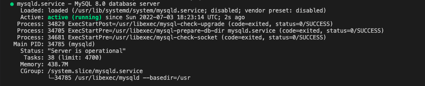

- Our database and web-server users are created via:

```
sudo mysql
CREATE DATABASE <DATABASE_NAME>;
CREATE USER `myuser`@`<Web-Server-Private-IP-Address>` IDENTIFIED BY 'mypass';
GRANT ALL ON <DATABASE_NAME>.* TO 'myuser'@'<Web-Server-Private-IP-Address>';
FLUSH PRIVILEGES;
SHOW DATABASES;
exit
```
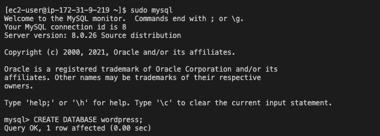
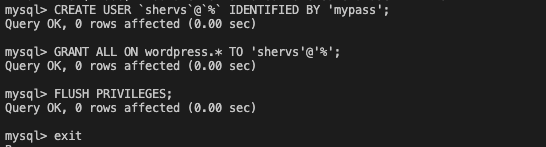

## WordPress Installation & Configuration

- Firstl, we ammend the security groups of the web-server to allow TCP on port 80

```
sudo yum -y update

#install wget, apache, and dependencies
sudo yum -y install wget httpd php php-mysqlnd php-fpm php-json

#start Apache
sudo systemctl enable httpd sudo systemctl start httpd

sudo systemctl restart httpd

# Download wordpress in var/www/.html
mkdir wordpress 
cd wordpress 
sudo wget http://wordpress.org/latest.tar.gz 
sudo tar xzvf latest.tar.gz 
sudo rm -rf latest.tar.gz 
cp wordpress/wp-config-sample.php wordpress/wp-config.php 
cp -R wordpress /var/www/html/

```

- We configure apache so it could use worpress by changing the `/etc/httpd/conf/httpd.conf` file.

```
sudo vi /etc/httpd/conf/httpd.conf
```
and change the `AllowOverride` to:

```
AllowOverride All
Order allow,deny
Allow from all
```
then restart apache `sudo systemctl restart apache`.

- Lastly we test to see if we can make a remote connection to our database server, if successful we can put these credentials in wordpress's `wp-config.php`.

```
sudo yum install mysql
sudo mysql -u <USER> -p -h <DB-Server-Private-IP-address>
```
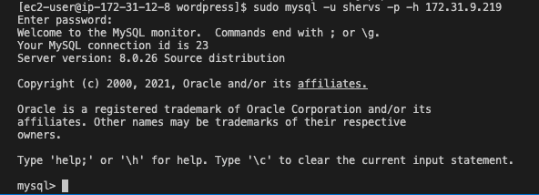

- Finally, within `var/www/html/wordpress`, we `sudo vi ar/www/html/wordpress/wp-config.php` where we change the credentials to access our database.

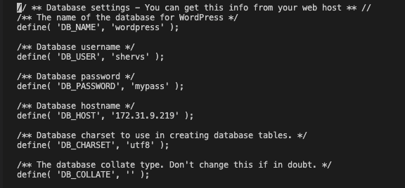

## Results

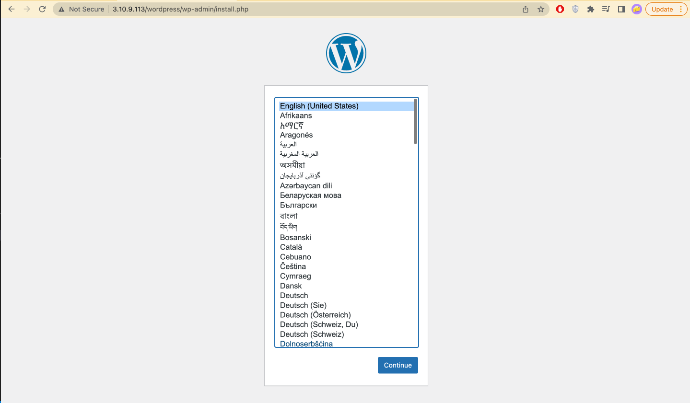
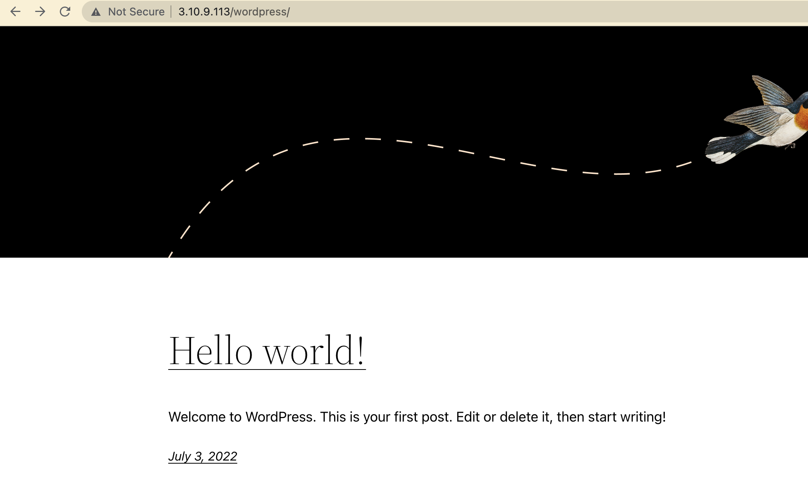

