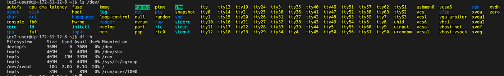

# Intro

In this project I will deploy a full-scale three tier web solution with the WordPress content management system. This will consist of: 
- Configuring storage system for Web and Database servers.
- Install and connect WordPress to MySQL database server.


My three-tier architecture will involve:
- Client - My personal Laptop
- Web Server - A configured EC2 (wordpress)
- Database - A configured EC2 (DB)

The linux based distribution I will be using is 'RedHat'.


## Web Server

- Firstly we spin-up an ec2 'RedHat', that will serve as a our web-server.
- Next we create 3 new volumes in the same AZ as our web-server with each being 1gb and attach them to our ec2 instance.


- We can see the attached block devices to our web server through `lsblk`.


```
# to seee mounts
df -h 
```
<<<<<<< HEAD

=======


>>>>>>> 6c412f9c44dea616d4ec323087dc77704a44a32b

- Next we move on to creating one partition in each of the three volumes 'xvdf', 'xvdg', and 'xvdh'.

```
sudo gdisk /dev/xvdf
# input values include 'n', 'w', and 'yes'
```


- A check to view partitions `lsblk`.


- We can also view these partiotions via:

```
sudo ym install lvm2
sudo lvmdiskscan
```


- Next we use `pvcreate` to mark each of the disks as physical volumes.

```
sudo pvcreate /dev/xvdf1
sudo pvcreate /dev/xvdg1
sudo pvcreate /dev/xvdh1

# verify
sudo pvs
```


- We then use `vgcreate` to add all three physical volumes to a volume group called <strong>webdata-vg</strong>.

```
sudo vgcreate webdata-vg /dev/xvdh1 /dev/xvdg1 /dev/xvdf1

# verify
sudo vgs
```


- We next move on to creating our logical volumes (LV), we shall call it <strong>apps-lv</strong>, and <strong>logs-lv</strong>.

```
sudo lvcreate -n logs-lv -L 14G webdata-vg
sudo lvcreate -n apps-lv -L 14G webdata-vg

# verify 
sudo lvs
```


- Finally we verify the volume setup:

```
# Complete view
sudo vgdisplay -v 

sudo lsblk
```
